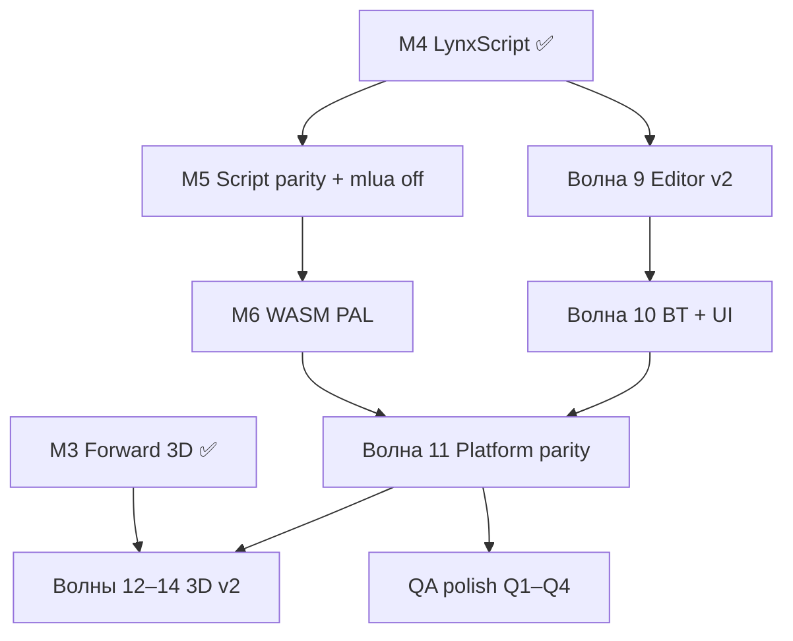

# Lynx — оставшиеся волны технических правок

Документ фиксирует **что осталось до «технически закрытого» универсального движка** после milestone **M4** (Lynx Core 3D + LynxScript v1). Монетизация и billing **не входят** в этот план ([BETA_FREE.md](BETA_FREE.md)).

Связанные документы:

- [LYNX_CORE_ARCHITECTURE.md](LYNX_CORE_ARCHITECTURE.md) — M0–M6 Core
- [ROADMAP_WAVES.md](ROADMAP_WAVES.md) — волны 0–8 ✅
- [ENGINE_UNIVERSAL.md](ENGINE_UNIVERSAL.md) — целевая архитектура

---

## Текущая точка (M4 ✅)

| Milestone | Версия | Статус |
|-----------|--------|--------|
| M1 PAL + D3D12 clear | `0.1.0-m1` | ✅ |
| M2 2D batch + FFI | `0.2.0-m2` | ✅ |
| M3 Forward 3D + shadow 2k + GLB | `0.3.1-m3` | ✅ |
| M4 LynxScript v1 + dual-run | `0.4.0-m4` | ✅ |
| M5–M6 SceneRuntime + WASM PAL | `0.6.0-m6` | ✅ |

Legacy `engine/` + Flutter Editor + волны 0–8 — рабочая база для следующих итераций.

---

## Блок A — Lynx Core M5–M6 ✅

| ID | Задача | Статус |
|----|--------|--------|
| **M5a** | LynxScript: `set_velocity`, `action_*`, keys, `on_signal` stub | ✅ `player.lynxscript` |
| **M5b** | Feature `legacy_lua` | ✅ `cargo build --no-default-features` |
| **M5c** | SceneRuntime + FFI `scene_load` / `scene_runtime_*` | ✅ |
| **M6a** | WASM PAL stub | ✅ `wasm32-unknown-unknown` |
| **M6b** | Web: WebSceneEngine fallback | ✅ документировано |
| **M6c** | Mobile batch FFI | ✅ `PLATFORM_QA.md` |

**Проверка:** `scripts/run-m5-m6-regression.ps1` · [LYNX_CORE_M5_M6.md](LYNX_CORE_M5_M6.md)

---

## Блок B — Волна 9: Редактор Pro v2 ✅

| ID | Задача | Статус |
|----|--------|--------|
| **9a** | AnimationPlayer v2: дорожки, blend preview | ✅ `animation_player_panel.dart` |
| **9b** | Key events → signal в `animation_clips` | ✅ engine `AnimKeyEvent` |
| **9c** | TileMap collision preview | ✅ chip «Collision» в toolbar |
| **9d** | `EDITOR_GODOT_PARITY.md` ≥ 80% | ✅ 16/20 |

**Проверка:** `scripts/run-wave9-regression.ps1` · `projects/platformer-demo` (run clip `footstep` @ frame 1)

---

## Блок C — Волна 10: BT debug + UI layout ✅

| ID | Задача | Статус |
|----|--------|--------|
| **10a** | BT debugger в Play (`BtDebugOverlay` + `scene_drain_bt_debug_json`) | ✅ |
| **10b** | Breakpoint path + Step (`scene_set_bt_breakpoint`) | ✅ |
| **10c** | UI anchors/margin/theme (`scene_ui_codec.dart` v2) | ✅ |
| **10d** | UI preview 16:9 / 9:16 в инспекторе | ✅ `ui_layout_preview_panel.dart` |

**Demo:** `PatrolEnemy` в `platformer-demo` с `leaf_patrol` BT.

**Проверка:** `scripts/run-wave10-regression.ps1`

---

## Блок D — Волна 11: Паритет платформ ✅

| ID | Задача | Статус |
|----|--------|--------|
| **11a** | Единый `PLATFORM_QA.md` + матрица 4 платформ | ✅ |
| **11b** | `webRuntime` в project.json + `lynx_export.json` | ✅ `web_scene_engine` / `wasm_core_stub` |
| **11c** | Touch + gamepad — чеклист wave2 | ✅ `PLATFORM_QA.md` |
| **11d** | `minLynxCoreVersion` + `getInstalledRuntimeVersions` + Hub `0.6.0-m6` | ✅ |

**Проверка:** `scripts/run-wave11-regression.ps1` · demo `projects/platformer-wave2`

---

## Блок E — Волны 12–14: Нативный 3D v2

M3 закрыл **forward PBR-lite + shadow 2k** в Core. Дальше — текстуры, скелеты, terrain, физика 3D.

| Волна | ID | Содержание | Статус |
|-------|-----|------------|--------|
| **12** | 12a | PBR albedo JSON + CPU tint в `Forward3DFrame` | ✅ [LYNX_CORE_WAVE12.md](LYNX_CORE_WAVE12.md) |
| | 12b | GPU albedo + UV | ✅ |
| | 12c | Shadow 3×3 PCF + 2-cascade | ✅ |
| **13** | 13a | GLTF skinning + animation clips | ✅ [LYNX_CORE_WAVE13.md](LYNX_CORE_WAVE13.md) |
| | 13b | Terrain heightmap mesh + LOD | ✅ [LYNX_CORE_WAVE13.md](LYNX_CORE_WAVE13.md) |
| **14** | 14a | 3D colliders + rigid body | ✅ [LYNX_CORE_WAVE14.md](LYNX_CORE_WAVE14.md) |
| | 14b | Occlusion / frustum culling hi-z | ✅ [LYNX_CORE_WAVE14.md](LYNX_CORE_WAVE14.md) |

Таблица зависимостей (архив)

| Волна | ID | Содержание | Зависит от |
|-------|-----|------------|------------|
| **12** | 12a | PBR текстуры (albedo/metallic-roughness) в GPU | M3 ✅ |
| | 12b | Normal map, IBL stub | 12a |
| | 12c | Shadow PCF quality + cascade (optional) | M3 shadow ✅ |
| **13** | 13a | GLTF skinning + animation clips | 12a |
| | 13b | Terrain heightmap mesh + LOD | 12a |
| **14** | 14a | 3D colliders + rigid body (свой solver или Rapier **вне** hot path) | 13a |
| | 14b | Occlusion / frustum culling hi-z | 12c |

**Контракт сцены:** плагин `lynx.3d` без breaking changes; capability `render.3d.native`.

**Критерий волны 14:** demo «комната + PBR текстурированный объект + walk cycle» на Windows; Web — degraded preset. **Частично:** `projects/platformer-demo-3d-room` (room + PBR + physics + Q3); walk cycle / albedo texture — TBD.

**Проверка 12a:** `scripts/run-m12-regression.ps1`

---

## Блок F — QA и polish (после 11, параллельно 12)

| ID | Задача | Статус |
|----|--------|--------|
| **Q1** | `run-all-regression.ps1` (`-Tier quick` / `full`) | ✅ |
| **Q2** | `KNOWN_LIMITATIONS.md` sync | ✅ |
| **Q3** | Export presets: Core viewport path для Windows Player | ✅ |
| **Q4** | [PERFORMANCE_BUDGET.md](PERFORMANCE_BUDGET.md) | ✅ |

---

## Отложено (не технические правки)

| ID | Тема | Примечание |
|----|------|------------|
| **8d** | Billing платных пакетов | после BETA_FREE |
| — | Монетизация Hub | [BETA_FREE.md](BETA_FREE.md) |

---

## Рекомендуемый порядок

| Спринт (~2 нед.) | Фокус |
|------------------|-------|
| 1 | M5a–M5b LynxScript расширение |
| 2 | M5c + M6a WASM scaffold |
| 3 | Волна 9 |
| 4 | Волна 10 |
| 5 | Волна 11 |
| 6–8 | Волны 12 → 14 + Q polish |

---

## Метрики «технически готов»

| Метрика | Цель |
|---------|------|
| Hot path без mlua | M5b |
| 3D native Player (Win) | M3 ✅ + Q3 |
| Web 2D parity | M6 / волна 11 |
| Editor Godot parity 2D | волна 9–10 |
| PBR + character 3D demo | волна 14 |
| Full regression green | Q1 |
