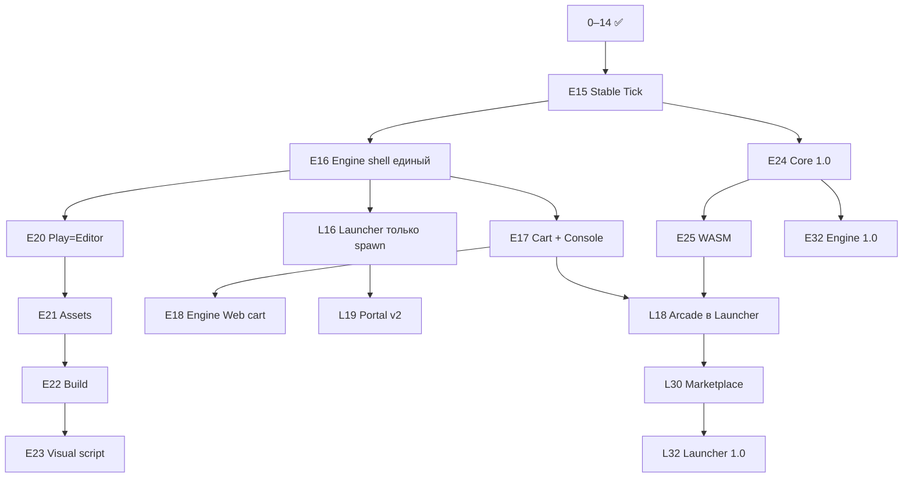

# Lynx — единая дорожная карта волн (2 продукта)

**Модель продукта:** только **два** установочных продукта. Всё остальное — модули внутри них или артефакты экспорта.

| Продукт | MSI / канал | Что внутри |
|---------|-------------|------------|
| **Lynx Launcher** | `Lynx-Launcher.msi`, Web Hub | Вход, мессенджер, облако, новости, магазин, проекты, **выбор и установка ядра**, **запуск работы** |
| **Lynx Engine** | `.lynxengine` (скачивается из Launcher) | **Редактор**, Play, экспорт, Player, рантайм Rust, инструменты TIC/Unity, Cart, сборка APK/EXE |

**Launcher не содержит редактора.** Launcher открывает **процесс Lynx Engine** с выбранной версией ядра и путём к проекту.

Связанные документы: [PRODUCT_ARCHITECTURE.md](PRODUCT_ARCHITECTURE.md) · [ROADMAP_WAVES.md](ROADMAP_WAVES.md) (волны 0–14 ✅)

---

## 1. Схема: кто за что отвечает

```
┌─────────────────────────────────────────────────────────────┐
│  LYNX LAUNCHER (портал, как было)                            │
│  · Учётная запись · Мессенджер · Новости · Маркетплейс       │
│  · Мои проекты (локальные + облачные)                        │
│  · Hub / Lynx Cloud · Аркада (каталог игр)                   │
│  · «Ядра движка» — список версий, скачать .lynxengine         │
│  · Кнопка «Открыть проект» → spawn Lynx Engine               │
└──────────────────────────┬──────────────────────────────────┘
                           │ argv: --engine=0.15.0 --project=…
┌──────────────────────────▼──────────────────────────────────┐
│  LYNX ENGINE (всё для создания и запуска игр)                │
│  ┌─────────────────────────────────────────────────────────┐│
│  │ UI движка (бывший Editor + Player + Export в одном shell) ││
│  │ Сцена · Код · Спрайт · Звук · Play · Сборка · Настройки   ││
│  └──────────────────────────┬──────────────────────────────┘│
│  ┌──────────────────────────▼──────────────────────────────┐│
│  │ Lynx Core (Rust): simulate · render · script · physics    ││
│  └─────────────────────────────────────────────────────────┘│
└─────────────────────────────────────────────────────────────┘
                           │
              Экспорт игры ▼
┌─────────────────────────────────────────────────────────────┐
│  Игра игрока (не отдельный продукт Lynx)                      │
│  MyGame.exe / APK / Web host — только game_data + runtime    │
└─────────────────────────────────────────────────────────────┘
```

### Поток пользователя (как сейчас, закрепляем)

1. Запуск **Launcher** → главная / проекты / облако.
2. Создать или выбрать проект.
3. Launcher проверяет `minLynxCoreVersion` / `engine_lock.json`.
4. Если ядра нет → экран **«Ядра движка»** → скачать `.lynxengine` нужной версии.
5. **«Работать»** → `LynxEngine.exe` (или `engine_shell` на Android) с проектом.
6. Вся работа — **внутри Engine**: редактирование, Play, экспорт, Cart.

### Web + Android + PC

| Канал | Launcher | Engine |
|-------|----------|--------|
| **Windows** | `LynxLauncher.exe` (MSI) | Процесс из `%LOCALAPPDATA%\Lynx\engines\<ver>\` + UI shell |
| **Android** | Приложение «Lynx» (вкладки портала) | Activity «Редактор» / полноэкранный Engine |
| **Web** | `lynx-hub.ru` — Hub, вход, аркада | `/engine` — WASM + UI (облегчённый Engine) |

Один контракт `project.json` + сцены v3 на всех PAL.

---

## 2. Версии

| Что версионируется | Формат | Где выбирается |
|--------------------|--------|----------------|
| **Launcher** | `1.x` (MSI) | Обновление через установщик / store |
| **Engine** | `0.15.0`, `1.0.0` (`.lynxengine`) | Launcher → «Ядра движка» |
| **Проект** | `studioEngineBoundVersion` в lock | При создании / открытии |

---

## 3. Фаза I — выполнено (волны 0–14, оба продукта)

Исторические волны см. [ROADMAP_WAVES.md](ROADMAP_WAVES.md).  
С точки зрения **2 продуктов**:

| Волна | Launcher | Engine |
|-------|----------|--------|
| 0–4 | Проекты, Play gate | Play=Editor, export, паритет |
| 5–6 | Шаблоны в MSI | Редактор Pro, 3D плагин |
| 7–8 | Cloud API, маркетплейс | Плагины из каталога |
| 9–11 | — | Editor v2, BT, platform QA |
| 12–14 | — | Lynx Core 3D v2 |

---

## 4. Фаза II — Стабильное ядро и разделение shell (волны 15–18) ✅

Реализовано: Stable Tick, LynxEngine shell, Lynx Cart + Console (редакторы подключены), Cloud Arcade API, Web cart runtime (Fengari), Android EngineActivity, L16b (`/engine-web` только Web).

| Хвост | Статус |
|-------|--------|
| E17b Console editors | ✅ Script/Sprite/Scene/Sound panels |
| E18b WASM Core (браузер) | 🔲 Phase IV / E25 |
| L16b Launcher без editor | ✅ (кроме `/engine-web` на Web) |

---

## 5. Фаза III — Launcher как портал, Engine как Unity-студия (волны 19–23) ✅

### Волна 19 — **Launcher: портал v2** ✅

| ID | Задача | Статус |
|----|--------|--------|
| L19a | Модули: Главная · Мессенджер · Магазин · Проекты · Новости | ✅ |
| L19b | Единый **Центр ядер**: список `.lynxengine`, скачать, удалить | ✅ |
| L19c | Диалог выбора версии ядра при открытии проекта | ✅ |
| L19d | «Проект требует 0.16, установить?» | ✅ |
| L19e | Launcher не грузит `engine.dll` | ✅ |

---

### Волна 15 — **Engine: Stable Tick** (Core 0.15) — архив фазы II

**Цель:** убрать путаницу «Launcher = редактор». Всё в **Engine UI**.

| ID | Задача |
|----|--------|
| E16a | `LynxEngine.exe` — единая точка входа (`main_engine.dart` = editor + player + export) |
| E16b | Вкладки движка: **Проект · Сцена · Код · Ассеты · Play · Сборка** |
| E16c | Launcher только: `Process.start(engineExe, ['--project', path, '--engine-ver', ver])` |
| E16d | Закрытие Engine → возврат в Launcher (опционально поднять окно) |
| L16a | Launcher: кнопка «Работать» вместо маршрута `/engine` внутри Launcher |
| L16b | Launcher: убрать встроенный `EngineMainPage` из `main.dart` router (если остался) |

**Критерий:** в Launcher нет холста сцены; только список проектов и кнопка запуска Engine.

---

### Волна 17 — **Engine: Lynx Cart + Console mode** (идеи TIC-80)

| ID | Задача |
|----|--------|
| E17a | Формат `.lynxcart` (один файл игры) |
| E17b | Режим **Консоль** в Engine: 6 вкладок (Код/Спрайт/Карта/Звук/Музыка/Play) |
| E17c | Режим **Проект** (Unity-глубина): сцены, 3D, BT, Blueprint |
| E17d | Переключатель Консоль ↔ Проект внутри Engine |
| E17e | Pack cart из Engine → «Опубликовать в облако» (API вызывает Launcher token) |

**Критерий:** cart-игра собирается без знания иерархии Godot.

---

### Волна 18 — **Launcher: Cloud Arcade** + **Engine: Web runtime**

| ID | Продукт | Задача |
|----|---------|--------|
| L18a | Launcher | Вкладка **Аркада**: каталог `free_to_play` |
| L18b | Launcher | «Играть» → Web: открыть `/play/:cartId` или spawn Engine с cart |
| L18c | Launcher | Карточки игр, теги, поиск (как SURF, свой UI) |
| E18a | Engine | Загрузка cart по URL / из облака в Play-only режиме |
| E18b | Engine | WASM Core для cart в браузере (без полного редактора) |
| L18d | Launcher | `cloudPublish` в проекте → кнопка «Выложить» после сборки в Engine |

**Критерий:** Tetris в аркаде — игра в Chrome из Launcher без MSI Engine на машине игрока (Web).

---

### Волна 20 — **Engine: Play = Editor v2** ✅

| ID | Задача | Статус |
|----|--------|--------|
| E20a | Один viewport pipeline (Preview = Play) | ✅ `unified_play_viewport.dart` |
| E20b | Pixel-perfect, фикс. камера для console/cart | ✅ `resolvePlayScale` + cart/console |
| E20c | Win / Android / Web — один snapshot тест | ✅ `wave19_23_test.dart` |

---

### Волна 21 — **Engine: Asset Pipeline** (Unity-like)

| ID | Задача | Статус |
|----|--------|--------|
| E21a | `.meta.json` v2, reimport, hot reload | ✅ `asset_meta_v2.dart` |
| E21b | Префабы v2 | ✅ `LynxPrefabRefV2` |
| E21c | Импорт пакетов из Cloud | ✅ `lynx_cloud_asset_import.dart` |

---

### Волна 22 — **Engine: Build & Export**

| ID | Задача | Статус |
|----|--------|--------|
| E22a | Build profiles: Win / APK / Web / Cart | ✅ `lynx_build_profiles.dart` |
| E22b | Счётчик прогресса сборки N/M | ✅ export sheet |
| E22c | Player template внутри Engine pack | ✅ `build-lynx-engine-full-pack.ps1` |
| L22a | Launcher: ярлык «Скачать собранную игру» | ✅ `lynx_built_games_registry.dart` + `LynxBuiltGamesPanel` |

---

### Волна 23 — **Engine: Visual Scripting + BT**

| ID | Задача | Статус |
|----|--------|--------|
| E23a | LynxGraph v2, компиляция в LynxScript | ✅ (базовый compiler) |
| E23b | BT live debug в Play | ✅ `lynx_graph_live_debug.dart` |
| E23c | Шаблоны в Engine pack | ✅ extras/templates в `.lynxengine` |

---

## 6. Фаза IV — Один Core, все платформы (волны 24–27) ✅

### Волна 24 — **Engine: Core 1.0** ✅

| ID | Задача | Статус |
|----|--------|--------|
| E24a | LynxScript primary, `legacy_lua` optional | ✅ `default = []` в `engine/Cargo.toml` |
| E24b | `.lynxengine`: dll + shell + shaders | ✅ `build-lynx-engine-full-pack.ps1` |
| E24c | iOS xcframework в pack | ✅ `--ios-xcframework-zip` в pack script |
| L24a | Launcher manifest: размер + changelog | ✅ `NexusEngineReleaseInfo` + UI |

---

### Волна 25 — **Engine: Web (WASM)** ✅

| ID | Задача | Статус |
|----|--------|--------|
| E25a | Полный Core в WASM | ✅ `lynx_core.wasm` + `lynx_wasm_core.js` |
| E25b | Hub → `/engine-web?project=cloud:id` | ✅ router + `EngineBootstrap` |
| L25a | Launcher Web = портал; Engine `/engine-web` | ✅ |
| E25c | PWA «Установить редактор» | ✅ `manifest.json` shortcut Engine |

---

### Волна 26 — **Engine: Render unified** ✅

| ID | Задача | Статус |
|----|--------|--------|
| E26a | Core batch2d + forward3d probe | ✅ `lynx_unified_render.dart` |
| E26b | Web degraded (Flutter Canvas) | ✅ fallback в capabilities |

---

### Волна 27 — **Engine: Physics & Audio unified** ✅

| ID | Задача | Статус |
|----|--------|--------|
| E27a | physics2d в Core | ✅ `physics2d.rs` + FFI |
| E27b | audio mixer в Core | ✅ `audio.rs` + FFI |
| E27c | Legacy engine делегирует batch2d | ✅ `batch_sync.rs` (M2) |

Регрессия: `scripts/run-phase-iv-regression.ps1` · тесты `wave24_27_test.dart`

---

## 7. Фаза V — Unity+ / RenEngine / экосистема (волны 28–32) ✅

### Волна 28 — **Engine: Narrative (Ren-ось)** ✅

| ID | Задача | Статус |
|----|--------|--------|
| E28a | Dialog JSON codec + ветвления | ✅ `narrative_codec.dart` |
| E28b | VN player screen | ✅ `narrative_vn_screen.dart` |
| E28c | `assets/narrative/dialog.json` load/save | ✅ `narrative_service.dart` |

### Волна 29 — **Launcher + Engine: Live Ops** ✅

| ID | Задача | Статус |
|----|--------|--------|
| L29a | Remote config service | ✅ `live_ops_config_service.dart` |
| L29b | Leaderboards API contract | ✅ `live_ops_leaderboard_service.dart` |
| E29a | Cloud saves hook (runtime read config) | ✅ LiveOps в Engine bootstrap |

### Волна 30 — **Launcher: Marketplace production** ✅

| ID | Задача | Статус |
|----|--------|--------|
| L30a | Billing purchase contract | ✅ `lynx_marketplace_billing.dart` |
| L30b | Creator dashboard stub | ✅ `LynxCreatorDashboard` |
| L30c | Cart moderation queue hook | ✅ Arcade publish flow |

### Волна 31 — **Launcher: соц. слой + Engine: co-edit** ✅

| ID | Задача | Статус |
|----|--------|--------|
| L31a | Presence heartbeat | ✅ `collab_presence_service.dart` |
| E31b | Scene edit locks | ✅ `CollabSceneLockService` |
| L31c | Messenger (было) | ✅ `messenger_screen.dart` |

### Волна 32 — **Lynx 1.0 GA** ✅

| ID | Задача | Статус |
|----|--------|--------|
| L32a | Launcher 1.0 version gate | ✅ `lynx_ga_gate.dart` |
| E32a | Engine Core 1.0 + TIC API layer | ✅ `tic_api.rs` + compact editors |
| E32b | TIC starter template | ✅ `projects/tic-starter` |

Регрессия: `scripts/run-phase-v-regression.ps1` · тесты `wave28_32_test.dart`

### TIC API layer (отдельная ветка в Engine, не отдельная фаза roadmap)

| Компонент | Путь |
|-----------|------|
| Native Lua API | `engine/src/tic_api.rs` — `spr`, `map`, `pix`, `btn`, `sfx`, `music` |
| Web Fengari | `client/web/lynx_lua_bridge.js` — `registerTicApi` |
| Compact editors | `tic_console_*_editor.dart` в режиме Консоль |
| Шаблон | `tic-starter`, `projectMode: tic` |

---

## 8. Сводка: TIC + Unity внутри **Engine**, SURF в **Launcher**

| Возможность | Где живёт | Волна |
|-------------|-----------|-------|
| Мессенджер, новости, облако | **Launcher** | было / L19 |
| Выбор версии ядра | **Launcher** | было / L19 |
| Запуск работы | **Launcher** → spawn **Engine** | L16 |
| Каталог free-to-play | **Launcher** Аркада | L18 |
| Редактор сцены, код, Play | **Engine** | E16–E20 |
| Sprite/Map/SFX (TIC) | **Engine** режим Консоль | E17 |
| Сцены, 3D, BT (Unity) | **Engine** режим Проект | 0–14, E21–E23 |
| Сборка APK/EXE | **Engine** | E22 |
| Рантайм Rust | **Engine** pack | E15, E24 |
| Игра без Lynx | Экспорт Player | E22 |

---

## 9. Зависимости



---

## 10. Ритм

| Спринт 2 нед. | Фокус |
|---------------|-------|
| 1 | E15 + начало E16 (shell) |
| 2 | L16 + E16 завершение |
| 3 | E17 Cart |
| 4 | L18 Arcade + E18 Web cart |
| 5+ | L19, E20… по таблице |

**Правило:** задача с префиксом **L** — только `client/main.dart` (Launcher). **E** — `main_engine.dart`, `engine/`, `lynx-core/`, Engine pack.

---

## 11. Следующий шаг

1. **TIC / Cart polish** — SFX/music synth runtime, `TIC()` callback persistence.
2. **Бэкап:** `scripts/backup-lynx-stable.ps1`.
3. **Phase V regression:** `scripts/run-phase-v-regression.ps1`.
4. **Engine pack 1.0:** `scripts/build-lynx-engine-full-pack.ps1 -Version 1.0.0`.

См. также [PRODUCT_ARCHITECTURE.md](PRODUCT_ARCHITECTURE.md).
