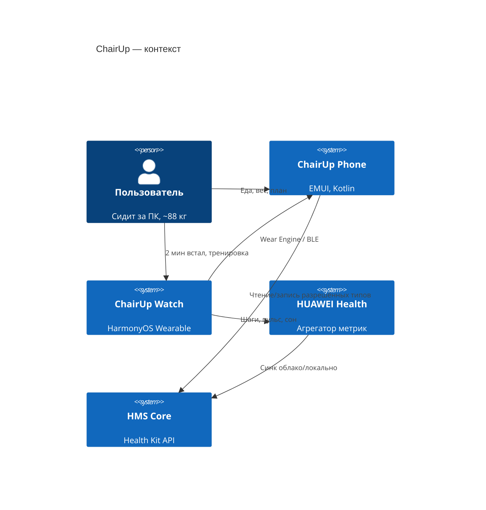
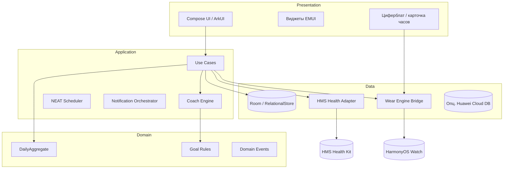
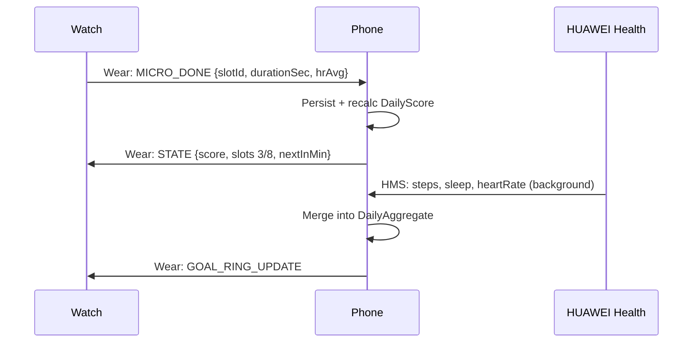

# Архитектура ChairUp (Huawei)

## Видение

**Один мозг на телефоне, один пульт на запястье.**  
Часы не дублируют сложную логику — они исполняют микро-команды и стримят биометрию. Телефон — коуч, история, еда, силовые, тренды.

## Контекст системы



## Слои (Clean + Event-driven)



### Принципы

| Принцип | Как |
|---------|-----|
| **Offline-first** | Все решения за день — из локальной БД; HMS — подтягивание и верификация |
| **Huawei Health как read-mostly** | Не конкурировать с Health; писать только свои сущности (микро-сессии, белок, силовая) |
| **Тонкие часы** | Watch: UI + сенсоры + ACK; тяжёлая логика на телефоне |
| **События, не опрос** | `StepsSynced`, `MicroSessionDone`, `ProteinLogged` → пересчёт дневного score |
| **Один Daily Score** | Пользователь видит 1 число 0–100, детали — по тапу |

## Модули телефона (`phone-android`)

```
:app                    → DI, navigation, theme
:feature-today          → кольца, CTA «2 мин»
:feature-chair          → таймер сидения, микро-слоты
:feature-nutrition      → белок, пресеты
:feature-strength       → шаблоны A/B
:feature-trends         → вес, талия, неделя
:feature-settings       → HMS auth, режим «не беси»
:core-domain            → entities, use cases interfaces
:core-coach             → rules engine (Kotlin)
:core-data              → Room, repositories
:integration-hms-health → Health Kit wrapper
:integration-wear       → Wear Engine / Message API
```

Gradle — **version catalog**, минимум `:app` знает про HMS только через `:integration-hms-health`.

## Модули часов (`watch-harmony`)

```
entry/src/main/ets/
├── entryability/       → Stage Model lifecycle
├── pages/
│   ├── Index.ets       → «Сегодня» 1 экран
│   ├── MicroTimer.ets  → 2-мин таймер
│   └── Workout.ets     → быстрая силовая
├── services/
│   ├── WearLink.ets    → связь с телефоном
│   └── HealthRead.ets  → локальные сенсоры / Health Service
├── widgets/            → форма циферблата (Service Widget)
└── common/             → дизайн-токены, i18n
```

## Coach Engine (сердце продукта)

Декларативные **правила** (YAML/JSON в assets, парсинг в Kotlin):

```yaml
# coach/rules/neat.yaml
- id: sedentary_alert
  when: steps_last_45min < 80 AND chair_mode == true
  then: notify_watch template=micro_break priority=low
  cooldown_minutes: 45

- id: micro_slot_morning
  when: hour in [10,11,12] AND micro_sessions_done < 3
  then: notify_phone template=micro_break
```

Движок: **Rete-lite** или простой pipeline `Condition → Action` с cooldown и DND (сон, «не беси»).

Выход: `CoachDecision` → Notification / Watch message / обновление Daily Score.

## Синхронизация Phone ↔ Watch



**Контракт сообщений** — `shared/contracts/wear-messages.schema.json` (версионируемый, `v1`).

Транспорт (по приоритету для Huawei):

1. **Wear Engine Kit** — если модель поддерживается  
2. **Huawei Wearable SDK** (legacy Bluetooth message)  
3. **Fallback** — только Health: часы пишут активность, телефон читает из HMS с задержкой 1–5 мин  

## Daily Score (формула v1)

```
score = clamp(0, 100,
  0.35 * micro_sessions_ratio +      # 8 слотов → %
  0.25 * protein_ratio +
  0.20 * steps_progress +
  0.10 * strength_done +
  0.10 * sleep_ok
)
```

`steps_progress` — не абсолют 10k, а **персональный baseline** + 500 шагов/неделя (адаптация).

## Безопасность и приватность

- Данные здоровья — **только на устройстве** + опциональный backup в зашифрованном HUAWEI Drive (v2)
- HMS scopes — минимальный набор (см. `02-huawei-ecosystem.md`)
- Нет продажи данных; аналитика — только агрегаты opt-in

## Масштабирование после MVP

| Направление | Решение |
|-------------|---------|
| HarmonyOS NEXT на телефоне | Второй flavor `:phone-harmony` ArkTS, общий `coach-engine` на KMP |
| AI еда по фото | On-device ML Kit / облако Huawei ML (волна 5+) |
| Социал | Отдельный микросервис, не в критическом пути |
| Тренер | Web-кабинет читает export JSON |

## Нефункциональные требования

| Метрика | Цель |
|---------|------|
| Холодный старт телефона | < 2 с до «Сегодня» |
| Расход батареи часов | < 3%/день фоновые пуши |
| Офлайн | 7 дней полная работа без сети |
| Crash-free | > 99.5% (AppGallery метрики) |

## «Вау»-дифференциаторы

1. **Режим «Кресло»** — одна кнопка; UI темнеет, только кольцо NEAT и вибрация на часах  
2. **Микро-победа за 120 сек** — не «тренировка», а игровой слот с haptic на часах  
3. **Тренд жира без весов** — прокси: талия + шаги + белок (ручной ввод талии раз в 14 дней)  
4. **Циферблат «Встал»** — прогресс 8 точек вокруг циферблата (HarmonyOS widget)  
5. **Неделя волн** — приложение само повышает цель (см. `03-mvp-waves.md`)
