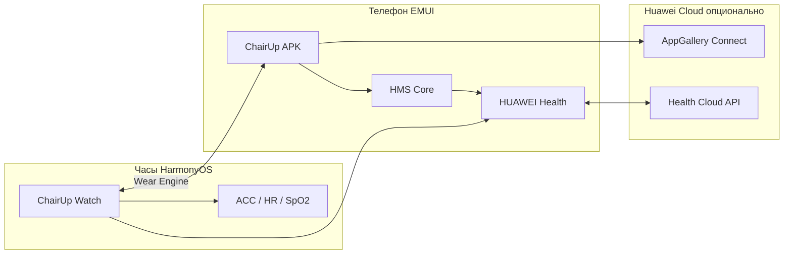

# Интеграция Huawei (EMUI + HarmonyOS)

## Карта экосистемы



## Телефон: HMS Health Kit

**Документация:** [Health Kit (HMS)](https://developer.huawei.com/consumer/en/hms/huaweihealth/)

### Регистрация

1. AppGallery Connect → создать приложение  
2. Включить **Health Kit**  
3. Настроить OAuth 2.0 redirect (для авторизации Health)  
4. Скачать `agconnect-services.json` → `phone-android/app/`

### Scopes (минимум для MVP)

| Тип данных | HMS DataType | Зачем |
|------------|--------------|-------|
| Шаги | `DT_CONTINUOUS_STEPS_DELTA` | NEAT, кольцо |
| Дистанция | `DT_CONTINUOUS_DISTANCE_DELTA` | опционально |
| Калории | `DT_CONTINUOUS_CALORIES_BURNT` | оценка дефицита |
| Пульс | `DT_INSTANTANEOUS_HEART_RATE` | силовая, восстановление |
| Сон | `DT_CONTINUOUS_SLEEP` | score, DND |
| Вес | `DT_INSTANTANEOUS_BODY_WEIGHT` | если вводит в Health |
| Тренировка | `DT_CONTINUOUS_WORKOUT` | импорт с часов |

**Запись от ChairUp в Health (волна 2+):**

- Кастомная активность `WORKOUT_CHAIR_MICRO` (короткая сессия 2 мин)  
- Или только локально + ручной «Other» в Health — проще на старте  

### Паттерн Adapter

```kotlin
interface HealthGateway {
  suspend fun authorize(): Result<Unit>
  suspend fun readTodaySteps(): StepsSample
  suspend fun readLastNightSleep(): SleepSample?
  suspend fun subscribeSteps(onUpdate: (StepsSample) -> Unit): Flow<Unit>
}

class HmsHealthGateway @Inject constructor(
  private val settingController: SettingController,
  private val dataController: DataController,
) : HealthGateway
```

- Один класс изолирует HMS → при смене API меняется только модуль  
- Ошибки: `USER_DENIED`, `HEALTH_NOT_INSTALLED`, `SYNC_DELAY` — UI с понятными текстами  

### EMUI-специфика

| Тема | Рекомендация |
|------|----------------|
| Фоновая работа | `WorkManager` + `ForegroundService` только на время синка |
| Энергосбережение | Экран «Исключения батареи» — onboarding шаг 2 |
| Автозапуск | Подсказка включить для ChairUp (EMUI 12+) |
| Виджет | EMUI виджет «Сегодня 67» — 2×2 |

## Часы: HarmonyOS Wearable

**IDE:** DevEco Studio 5.x  
**Модель:** API 9+ wearable, Stage Model  

### Возможности на часах

| Функция | API / компонент |
|---------|-----------------|
| Полноэкранный UI | ArkUI `Column`, `Progress` |
| Вибрация | `@ohos.vibrator` |
| Пульс в микро-сессии | Sensor / Health Service Kit |
| Циферблат | FormExtensionAbility (Service Widget) |
| Связь с телефоном | **Wear Engine** / Device Manager |

### Wear Engine (приоритет)

- Проверка совместимости: [Wear Engine поддерживаемые устройства](https://developer.huawei.com/consumer/en/doc/development/connectivity-Guides/device-support-0000001058221805)  
- Пакеты: `wearEngine` на телефоне (HMS) + на часах  

Сообщения:

```typescript
// watch: отправить микро-сессию
p2p.send({
  bundleName: 'com.chairup.phone',
  abilityName: 'EntryAbility',
  data: JSON.stringify({ v: 1, type: 'MICRO_DONE', slotId: 3, sec: 125 })
});
```

### Если Wear Engine недоступен

1. Пользователь жмёт «Готово» на часах → запись в **локальную БД часов**  
2. HUAWEI Health синкает активность на телефон  
3. ChairUp phone **poll HMS** каждые 15 мин в chair mode  

Задержка допустима для MVP; UX: «Синхронизировано ✓» после merge.

## HUAWEI Health как источник правды

**Не дублировать** шаги/сон вручную, если Health уже их имеет.

Стратегия merge:

```
display_steps = max(hms_steps, local_watch_steps_adjusted)
micro_sessions = только ChairUp DB
protein = только ChairUp DB
```

Конфликт веса: приоритет **ручной ввод в ChairUp** → опционально push в Health.

## AppGallery публикация

- Категория: Health & Fitness  
- Privacy policy: явно перечислить Health Kit data types  
- Тест на реальном Huawei без GMS (только HMS)  

## Ограничения (честно)

| Ограничение | Обход |
|-------------|-------|
| Нет Google Fit | Только HMS — ок для EMUI |
| Задержка синка Health 1–10 мин | UI «обновлено N мин назад» |
| Модели часов без Wear Engine | Fallback poll |
| HarmonyOS NEXT phone (без Android) | Волна 7 — отдельный ArkTS phone app |
| Состав тела с весов Huawei | Волна 4 — парсинг если API откроет |

## Чеклист разработчика

- [ ] Huawei ID для теста  
- [ ] Телефон + часы в одной учётке Health  
- [ ] DevEco + Android Studio  
- [ ] Реальные устройства (эмулятор часов ограничен)  
- [ ] `agconnect-services.json` не в публичный git  
