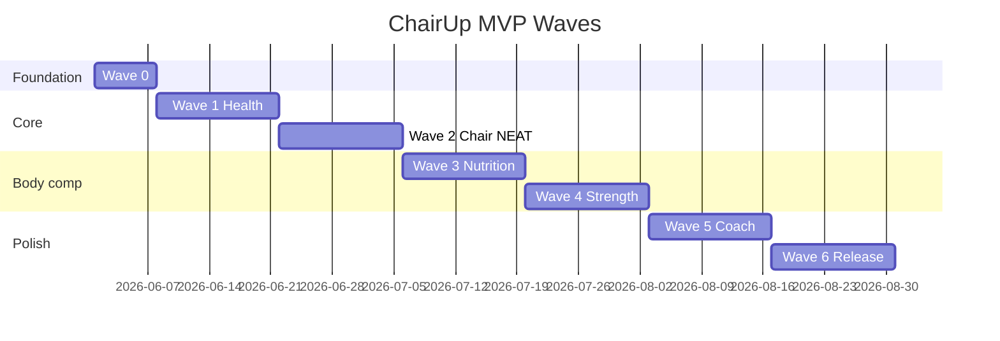

# MVP по волнам (Huawei)

Каждая волна — **релиз в TestFlight/AppGallery internal**, тест на своих EMUI + часах 5–7 дней, затем следующая.

Легенда: 🎯 цель волны · ✅ критерий приёмки · 📦 артефакты

---

## Wave 0 — Фундамент (1 неделя)

🎯 Репозиторий, CI, пустые приложения, HMS + DevEco собираются.

| Задача | Детали |
|--------|--------|
| Monorepo `fit-huawei/` | Gradle + DevEco project |
| `phone-android` | Compose, Navigation, Room, Hilt |
| `watch-harmony` | ArkTS, одна страница Hello |
| AGC | Health Kit включён, debug подпись |
| Дизайн-токены | Тёмная тема «кресло», акцент `#00D9A5` |

✅ APK ставится на EMUI, watch HAP на часы, логи без crash  
✅ HMS: экран «Подключить HUAWEI Health» открывает OAuth  

📦 Нет пользовательской ценности — только каркас.

---

## Wave 1 — «Вижу себя» (1–2 недели)

🎯 Чтение метрик из Health + простой дашборд.

| Функция | Реализация |
|---------|------------|
| Шаги сегодня / 7 дней | `HmsHealthGateway` |
| Сон прошлой ночи | бар + часы |
| Пульс в покое | последнее значение |
| Pull-to-refresh | форс-синк HMS |
| Онбординг 3 шага | Health → батарея → часы |

✅ Цифры совпадают с HUAWEI Health ± задержка синка  
✅ Работает офлайн с кэшем вчера  

📦 **MVP-α** — можно пользоваться как «красивым зеркалом Health».

---

## Wave 2 — Режим «Кресло» + микро-сессии (2 недели) ★ killer

🎯 Главная ценность для сидячего пользователя.

| Функция | Реализация |
|---------|------------|
| Toggle «Я за ПК» | `ChairMode` в БД |
| 8 слотов / день | окна 10:00–20:00, настраиваемые |
| Таймер 2 мин на часах | ArkUI + vibrate done |
| Wear: `MICRO_DONE` | Wear Engine → phone |
| Daily Score v1 | только micro + steps |
| Пуш EMUI | мягкий, cooldown 45 мин |
| Виджет 2×2 | score + «след. через N мин» |

✅ 8/8 слотов → score ≥ 35 по компоненте micro  
✅ Без Wear Engine: микро засчитывается кнопкой на телефоне  
✅ Батарея часов: < 5% за день теста  

📦 **MVP-β** — уже решает «ленивая жопа».

**Персональная волна 2 (неделя 1–4):**

| Нед | Микро-слотов | Цель шагов |
|-----|--------------|------------|
| 1 | 4 | baseline |
| 2 | 5 | baseline + 300 |
| 3 | 6 | baseline + 600 |
| 4 | 8 | baseline + 1000 |

Baseline = среднее шагов 7 дней до Wave 2.

---

## Wave 3 — Белок и вес (1–2 недели)

🎯 Жир: дефицит через поведение, не калориметрия.

| Функция | Реализация |
|---------|------------|
| Белок / день | слайдер + пресеты («3 яйца», «творог») |
| Цель белка | `weight_kg * 1.8` (редактируемо) |
| Вес | ручной ввод, график 30 дней, MA7 |
| Талия | раз в 14 дней напоминание |
| Daily Score v2 | + protein + weight trend |

✅ Один тап «как вчера» для белка  
✅ Тренд веса: линия MA7, не сырые скачки  

📦 **MVP-γ** — полный цикл «жир».

**Волна персонализации 3:**

- Нед 1–2: только учить белок (без жёсткого дефицита)
- Нед 3–4: подсказка «−300 ккал» текстом, без подсчёта калорий

---

## Wave 4 — Силовая «ленивец» (2 недели)

🎯 Мышцы: 2 шаблона, 20–35 мин.

| Функция | Реализация |
|---------|------------|
| Шаблон A / B | отжимания, присед, планка / выпады, резина |
| Таймер отдыха 60 с | на часах |
| Чекбоксы подходов | без RPE в v1 |
| Прогрессия | +1 повт/нед на упражнение |
| Импорт workout из Health | если часы записали «Силовая» |
| Daily Score v3 | + strength |

✅ 2 тренировки/нед → streak  
✅ Watch: старт/стоп + haptic между подходами  

📦 **MVP-1.0** — жир + мышцы + NEAT.

---

## Wave 5 — Умный коуч (2 недели)

🎯 «Вау» без ML-магии — правила + адаптация.

| Функция | Реализация |
|---------|------------|
| Coach Engine YAML | sedentary_alert, protein_reminder |
| Режим «Не беси» | DND 22–08, макс 6 пушей/день |
| Недельный отчёт | карточка «−0.4 кг тренд, 42 микро» |
| Циферблат 8 точек | HarmonyOS Form widget |
| Адаптация шагов | +500/нед если 5 дней выполнил |

✅ 0 пушей ночью при включённом DND  
✅ Отчёт генерируется локально < 500 ms  

📦 **MVP-1.5** — ощущение персонального тренера.

---

## Wave 6 — Полировка + AppGallery (1–2 недели)

🎯 Публикация и стабильность.

| Задача | Детали |
|--------|--------|
| Локализация | ru + en |
| Политика конфиденциальности | Health data disclosure |
| Crash / ANR | AppGallery Pre-launch report |
| Бета 10 пользователей | internal track |
| Backup | export JSON в Files |

✅ Crash-free ≥ 99.5% за 7 дней беты  
✅ Модерация AppGallery passed  

📦 **Public MVP 1.0**

---

## Wave 7+ (после MVP) — roadmap

| Волна | Фича |
|-------|------|
| 7 | HarmonyOS NEXT phone (ArkTS) |
| 8 | Фото еды → оценка белка (ML Kit) |
| 9 | Huawei Body Composition scales |
| 10 | Семейный челлендж (опц.) |
| 11 | Cloud sync Huawei Cloud DB |

---

## Сводная дорожная карта

**Итого до Store:** ~12–14 недель (1 dev full-time) или ~20 недель (вечера/выходные).

---

## Метрики успеха по волнам

| Волна | Метрика |
|-------|---------|
| 2 | ≥ 5 микро-сессий/день в среднем за неделю |
| 3 | белок ≥ 80% цели 5 дней/нед |
| 4 | ≥ 2 силовые/нед 3 недели подряд |
| 6 | MA7 вес −0.3…0.5 кг/нед (если соблюдал 70% score) |

---

## Что режем из MVP (не делаем до Wave 7)

- Соцсеть, чаты, лидерборды  
- Подсчёт каждой калории / штрихкоды  
- Интеграция не-Huawei часов  
- Web-кабинет  
- Платная подписка (можно позже: «волны+» коуч)
