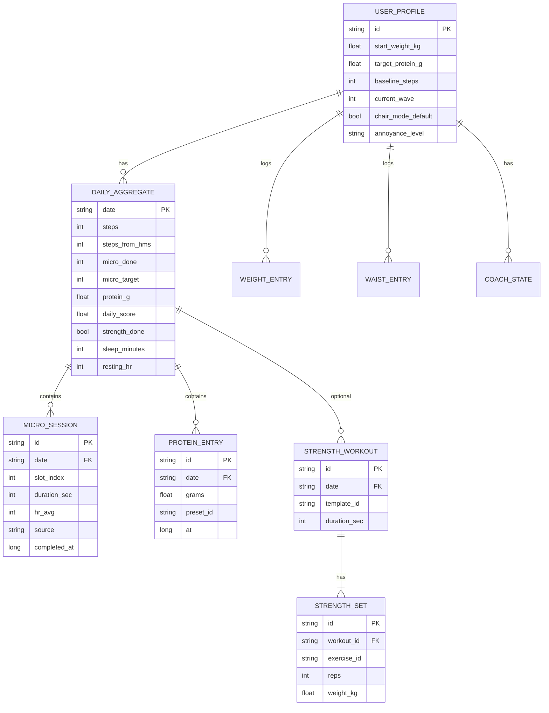

# Модель данных

## ER (локальная БД телефона)



## Domain events (внутренний bus)

| Event | Payload | Подписчики |
|-------|---------|------------|
| `HmsStepsUpdated` | `date, count, syncedAt` | RecalcScore, Widget |
| `MicroSessionCompleted` | `slotId, durationSec, source` | RecalcScore, WearSync |
| `ProteinLogged` | `grams, presetId?` | RecalcScore |
| `StrengthCompleted` | `templateId, sets[]` | RecalcScore |
| `WeightLogged` | `kg, at` | Trends, Coach |
| `ChairModeChanged` | `enabled` | Scheduler |
| `WaveAdvanced` | `waveNumber, params` | UI badge |

## HMS mapping

| ChairUp entity | HMS read | HMS write |
|----------------|----------|-----------|
| `DAILY_AGGREGATE.steps` | `DT_CONTINUOUS_STEPS_DELTA` | — |
| `DAILY_AGGREGATE.sleep_minutes` | `DT_CONTINUOUS_SLEEP` | — |
| `DAILY_AGGREGATE.resting_hr` | min HR sample 04–06 | — |
| `MICRO_SESSION` | — | опц. custom activity W4+ |
| `STRENGTH_WORKOUT` | `DT_CONTINUOUS_WORKOUT` import | — |

## Wear messages (v1)

См. `shared/contracts/wear-messages.schema.json`.

Типы:

- `STATE_PUSH` phone → watch  
- `MICRO_DONE` watch → phone  
- `START_MICRO` phone → watch  
- `STRENGTH_TICK` watch → phone (подход готов)  

## User goals (стартовые константы)

```kotlin
data class UserGoals(
  val microSlotsPerDay: Int = 8,
  val proteinGramsPerDay: Float,  // weight * 1.8f
  val strengthSessionsPerWeek: Int = 2,
  val weightTrendTargetKgPerWeek: Float = -0.4f,
  val waistRemindEveryDays: Int = 14,
)
```

При `current_wave` из профиля — `GoalRepository` подставляет ослабленные/усиленные значения.

## Room (фрагмент)

```kotlin
@Entity(tableName = "daily_aggregate")
data class DailyAggregateEntity(
  @PrimaryKey val date: String, // yyyy-MM-dd
  val steps: Int,
  val stepsFromHms: Int,
  val microDone: Int,
  val microTarget: Int,
  val proteinG: Float,
  val dailyScore: Float,
  val strengthDone: Boolean,
  val sleepMinutes: Int?,
  val restingHr: Int?,
  val updatedAt: Long,
)
```

Индексы: `date` PK, `micro_session(date, slot_index)` unique.

## Watch local store (HarmonyOS)

Минимум — **Preferences** + очередь исходящих:

```typescript
interface PendingOutbox {
  messages: WearMessage[];
}
```

Не хранить историю недель на часах — только `todayMicroDone: number[]`, `lastScore: number`.
