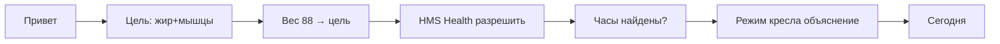

# UX и сценарии

## Дизайн-язык «Кресло»

| Токен | Значение |
|-------|----------|
| Фон | `#0B0F14` (глубокий графит) |
| Акцент | `#00D9A5` (микро-победа) |
| Предупреждение | `#FFB020` (мало белка) |
| Типографика | HarmonyOS Sans / Roboto |
| Форма | крупные радиусы 20dp, одна главная CTA |

**Не** фитнес-брокерский красный и агрессивные «СЖЕЧЬ ЖИР!!!».

## Экран «Сегодня» (главный)

```
┌─────────────────────────────┐
│  ChairUp          ⚙️  🔥 67   │  ← Daily Score
├─────────────────────────────┤
│     ╭───╮ ╭───╮ ╭───╮       │
│     │3/8│ │142│ │ ✓ │       │  микро / белок / сила
│     ╰───╯ ╰───╯ ╰───╯       │
├─────────────────────────────┤
│  ┌─────────────────────┐  │
│  │   🪑 Кресло ВКЛ      │  │  toggle
│  └─────────────────────┘  │
│  ┌─────────────────────┐  │
│  │  ▶ 2 минуты сейчас   │  │  primary CTA
│  └─────────────────────┘  │
│  след. слот ~14:30 · 4.2k шагов │
└─────────────────────────────┘
```

Тап **2 минуты** → телефон шлёт `START_MICRO` на часы → полноэкранный таймер на wrist.

## Онбординг (≤ 90 сек)



Копирайт волна 2: *«Не заставим бегать. 8 раз по 2 минуты — уже победа.»*

## Микро-сессия на часах

```
┌──────────────┐
│   1:47       │  крупный таймер
│  пройдись    │  короткая подсказка
│  ○ ○ ● ○     │  4/8 слотов
│  [ Готово ]  │
└──────────────┘
```

- Вибрация на старте и за 10 с до конца  
- «Готово» раньше 90 с — засчитать, но пометить `duration < 90` (не блокировать)  

## Режим «Не беси»

| Уровень | Пуши / день | Ночь |
|---------|-------------|------|
| Мягкий | 4 | тихие |
| Норм | 6 | DND |
| Строгий | 10 | только микро |

## Силовая (ленивец)

Один экран, вертикальный список:

```
Отжимания    [✓] [✓] [ ]  +1 повт на след. нед
Приседания   [✓] [✓] [✓]
Планка 40с   [✓]
─────────────
Завершить · 24 мин
```

Без таблиц, без RPE.

## Недельный отчёт (волна 5)

Карточка-сторис:

1. Score средний  
2. Микро 34/56  
3. Белок 82%  
4. Вес MA7: −0.3 кг  
5. След. волна: +1 слот  

## Пустые состояния

| Ситуация | Текст |
|----------|-------|
| Health не подключён | «Подключи HUAWEI Health — я не угадываю шаги» |
| Часы offline | «Жми „Готово“ на телефоне — часы подтянутся» |
| 0 микро к 18:00 | «Ок, 2 минуты сейчас — и день не нулевой» |

## Доступность

- Минимум 48dp touch targets  
- TalkBack на CTA  
- Контраст WCAG AA на score ring  
